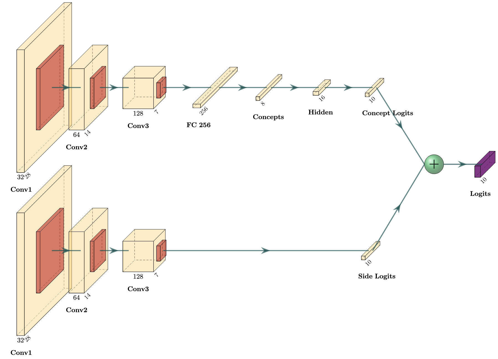
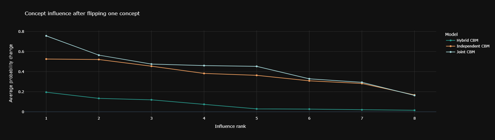

# Concept Bottleneck Models on Fashion-MNIST

An end-to-end PyTorch study of the trade-off between predictive performance,
interpretability and steerability in image classification.

The project compares a conventional CNN with independent, joint and hybrid
Concept Bottleneck Models (CBMs). It also tests whether a hybrid model relies on
its direct image side channel and measures how intervening on human-readable
concepts changes predictions.



## Highlights

- Built five neural architectures around a shared three-block CNN backbone.
- Predicted eight binary concepts for ten Fashion-MNIST classes.
- Compared classification accuracy, one-vs-rest AUROC and concept macro F1.
- Ran a six-level side-channel dropout experiment.
- Quantified concept steerability through single-concept interventions.
- Used reproducible seeds, early stopping and explicit PyTorch training loops.

## Final results

| Model | Test accuracy | AUROC | Concept macro F1 |
|---|---:|---:|---:|
| Joint CBM | **93.1%** | 0.995 | 0.966 |
| Hybrid CBM | 92.8% | **0.996** | 0.964 |
| Baseline CNN | 92.5% | **0.996** | - |
| Independent CBM | 83.8% | 0.987 | **0.967** |

The Joint CBM slightly outperformed the conventional baseline while preserving
an inspectable concept layer. The Independent CBM paid a larger accuracy cost
for its stricter bottleneck. The Hybrid CBM recovered predictive performance,
but its direct path made concept interventions less influential.



The reported values come from the executed submission notebook and final
report, using seed 42. They should be interpreted as a controlled course
experiment rather than a multi-seed benchmark.

## Project artifacts

- [Executed submission notebook](Project/notebooks/submission/CBMs_project.ipynb)
- [Final three-page report](Project/report/deep_learning.pdf)
- [Final result tables](Project/results/)
- [Reusable implementation](Project/src/)
- [Experiment runners](Project/scripts/)
- [Technical documentation](Project/README.md)

## Reproduce the notebook

```bash
cd Project
python -m venv .venv
source .venv/bin/activate
python -m pip install -r requirements.txt
jupyter lab notebooks/submission/CBMs_project.ipynb
```

Fashion-MNIST is downloaded automatically by `torchvision`. Full reproduction
trains several models and a dropout sweep, so runtime depends strongly on the
available accelerator.

## Scope and limitations

- Concepts are derived from class labels rather than independently annotated.
- Some classes share the same concept vector, creating a deliberate information
  bottleneck.
- Results are from Fashion-MNIST and one fixed random seed.
- The project studies model behaviour and interpretability trade-offs; it is not
  intended as a production image-classification system.

## Authors

Course project by Pablo Coma Valbuena and Ángel Ramos Ortiz.
